# Movies-ETL

## Project Overview

This project is an example of 'Data Wrangling' or 'Data Cleaning' as part of the Extract-Transform-Load (ETL) process in Data Analytics. We used Python and the Pandas, NumPy & SQLAlchemy libraries to extract, clean, transform, and merge datasets together and then load them into an SQL database. The datasets were derived from:

  1. a web-scrape of multiple movie pages on Wikipedia in JSON format
  2. an open source movie metadata CSV file from Kaggle
  3. MovieLens ratings from The Movie DB (TMDB)

## Results

#### Deliverable 1 - Write an ETL Function to Read Three Data Files : ETL_function_test.ipynb

- An ETL function to read in the three data files
- Converts the Wikipedia JSON file to a Pandas dataframe (**wiki_movies_df**)
  - A scrape of sidebar data for movies on Wikipedia from 1990 to 2018
    - Resources/wikipedia-movies.json
- Converts the Kaggle metadata file to a Pandas DataFrame (**kaggle_metadata**)
  - https://www.kaggle.com/rounakbanik/the-movies-dataset/download
    - Resources/movies_metadata.csv
- Converts the MovieLens ratings data file to a Pandas DataFrame (**ratings**)
  - https://www.themoviedb.org/
    - Resources/ratings.csv

wiki_movies_df dataframe result

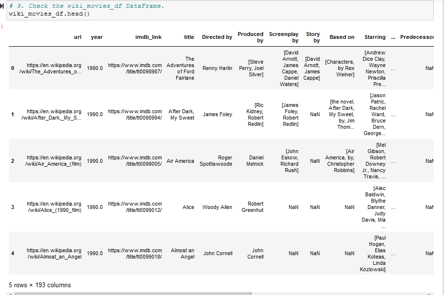

kaggle_metadata dataframe result

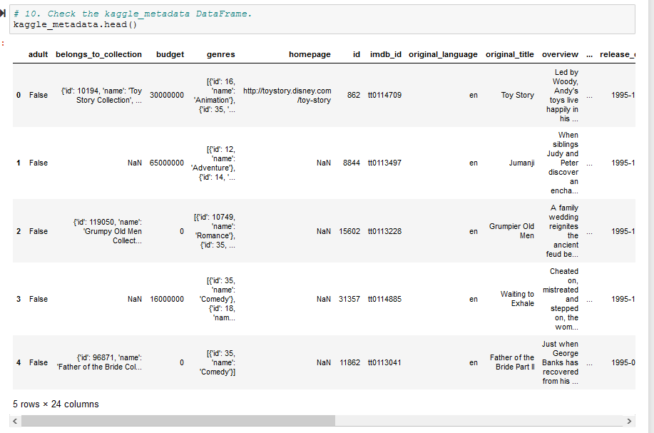

ratings dataframe result

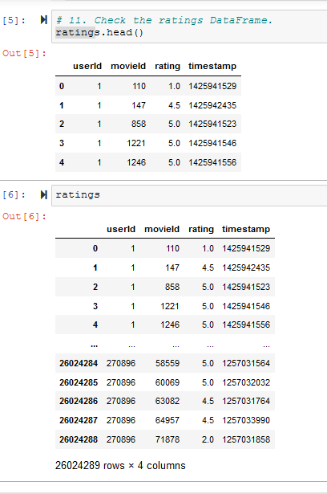

#### Deliverable 2 - Extract and Transform the Wikipedia Data : ETL_clean_wiki_movies.ipynb

- Extract and transform the Wikipedia data into **wiki_movies_df** DataFrame so we can merge it with the Kaggle metadata in Deliverable 3 below.

wiki_movies_df dataframe result (note the different columns from Deliverable 1 above)

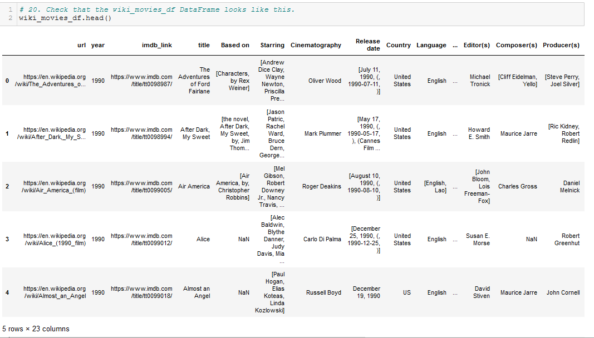

wiki_movies_df columns result

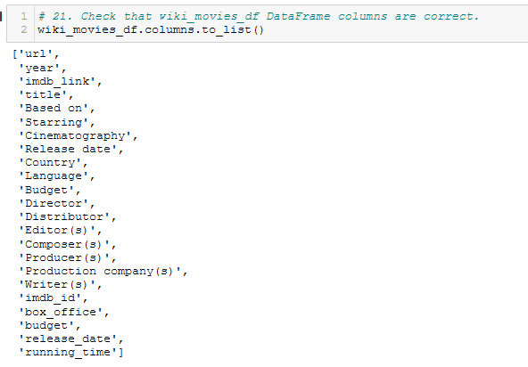

#### Deliverable 3 - Extract and Transform the Kaggle Data : ETL_clean_kaggle_data.ipynb

- Extract and transform the Kaggle metadata (**kaggle_metadata**) and MovieLens rating data (**ratings**)
- Merge the Kaggle metadata DataFrame (**kaggle_metadata**) with the Wikipedia movies DataFrame from Deliverable 2 above (**wiki_movies_df**) to create **movies_df** DataFrame.
- Then merge the MovieLens rating data (**ratings**) with **movies_df** to create the **movies_with_ratings_df** DataFrame.

wiki_movies_df dataframe result (same as Deliverable 2 above)

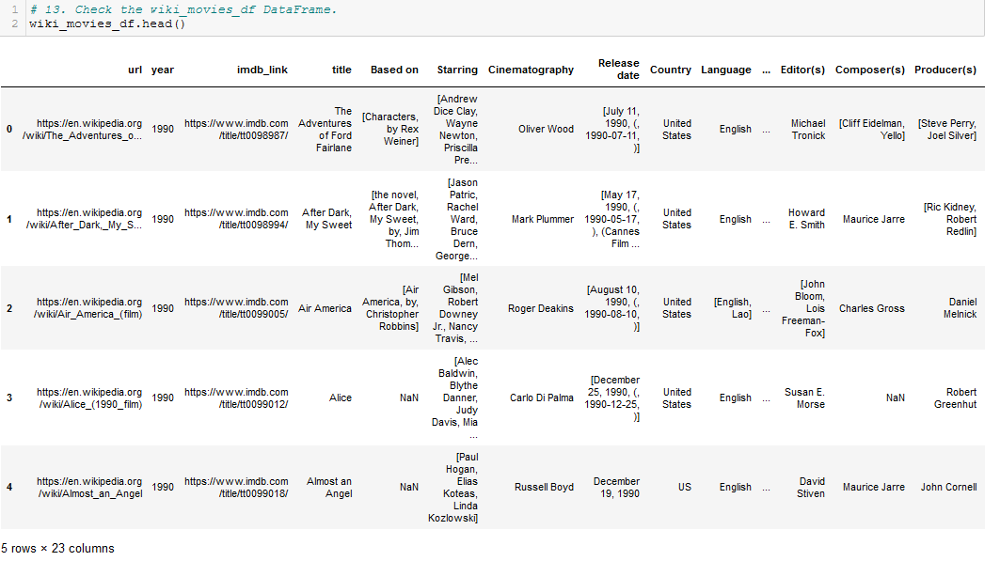

movies_with_ratings_df dataframe result (note the ratings columns on right)

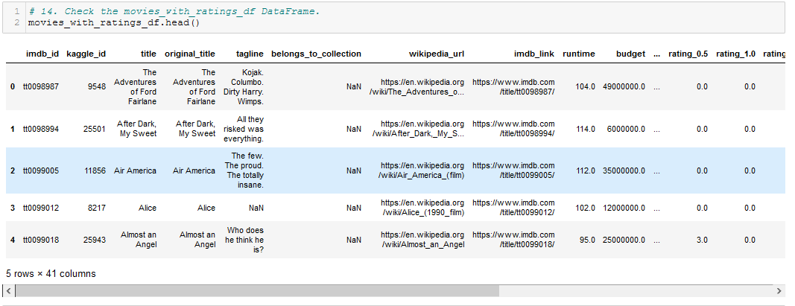

movies_df dataframe result (similar to wiki_movies_df and movies_with_ratings_df above, but different columns)

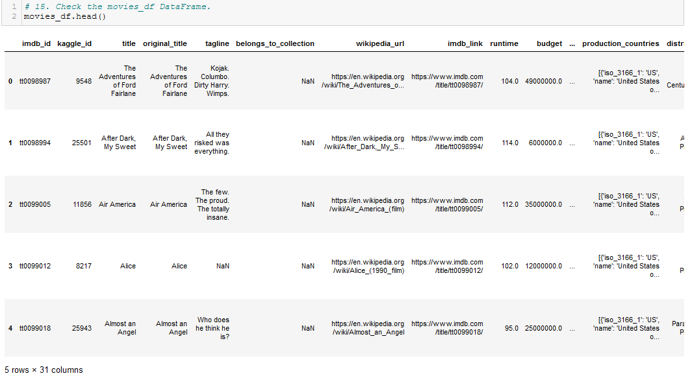

#### Deliverable 4 - Create the Movie and Ratings Databases using SQL in postgresql : ETL_create_database.ipynb

- Use movies_df.to_sql() to directly transfer all 6,052 rows of the movies_df DataFrame from Pandas to PostgreSQL using Python inside Jupyter Notebook.
- Use 'data = pd.read_csv()' to read ratings.csv in chunks of 1,000,000 rows each and 'data.to_sql()' to then transfer the chunks into PostgreSQL similar to the previous step. Chunking is required because ratings.csv has 26,024,289 rows. Trying to do the transfer in one call to 'to_csv()' would overwhelm the system. The entire transfer took appoximately an hour of wallclock time to complete.

Run time stats for transfer of movie_data database to PostgreSQL (3600.107  seconds)

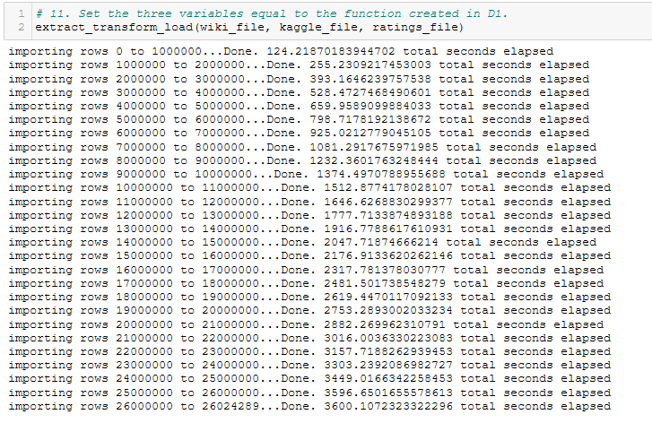

SQL to confirm row count (6,052) of movies table in movie_data database

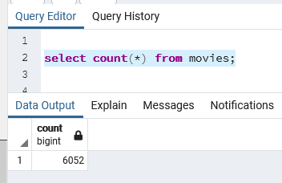

SQL to confirm row count (26,024,289) of ratings table in movie_data database

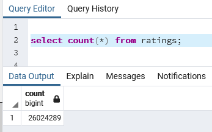

SQL to show first 10 rows of movies table (note rows are in ascending / normal index order)

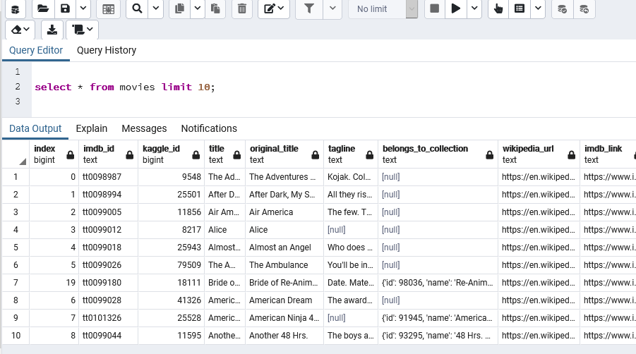

SQL to show first 10 rows of ratings table (note rows are in ascending / normal index order)

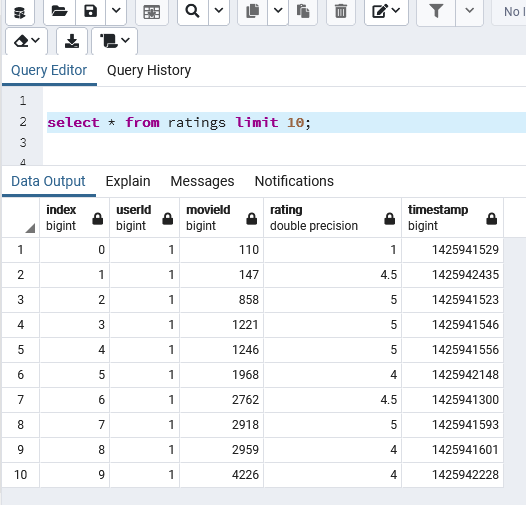

SQL to show last 10 rows of movies table (note rows are in descending / reverse index order)

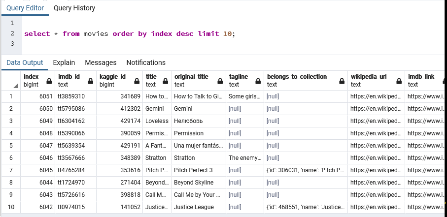

SQL to show last 10 rows of ratings table (note rows are in descending / reverse index order)

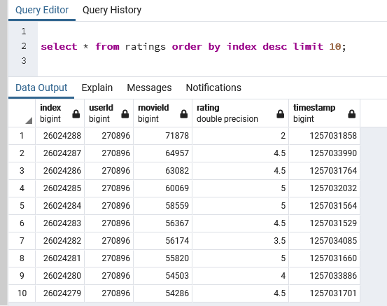

## Summary

All four deliverables were completed, and the results matched the samples given. Five Jupyter notebooks, with a total of 165 cells and 1,150 lines of Python code. The actual time to complete the project was substantially longer than the estimated time budget given at the start of the project.
